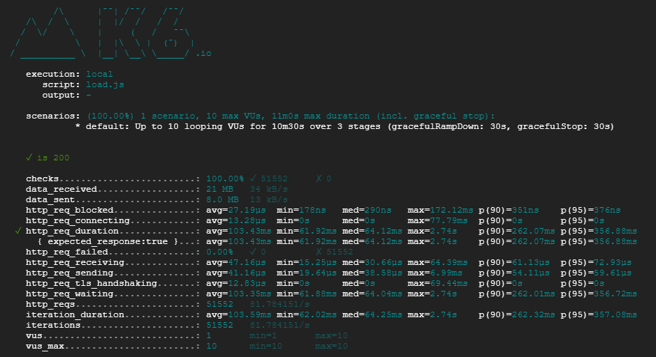
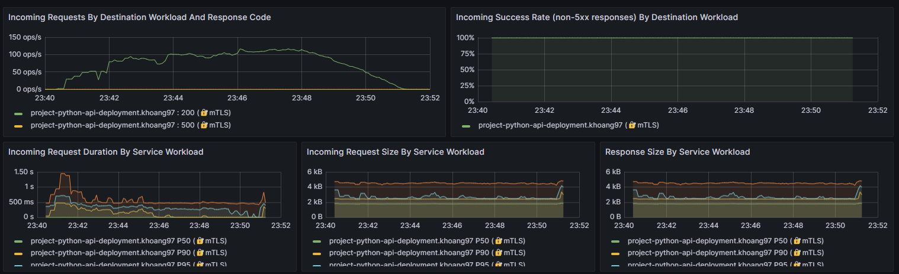
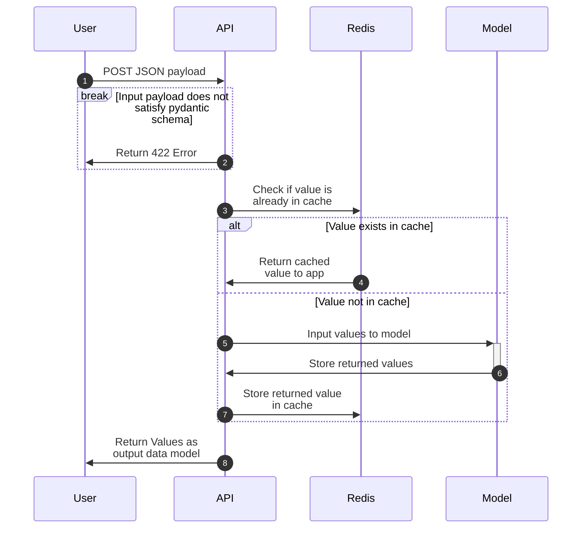
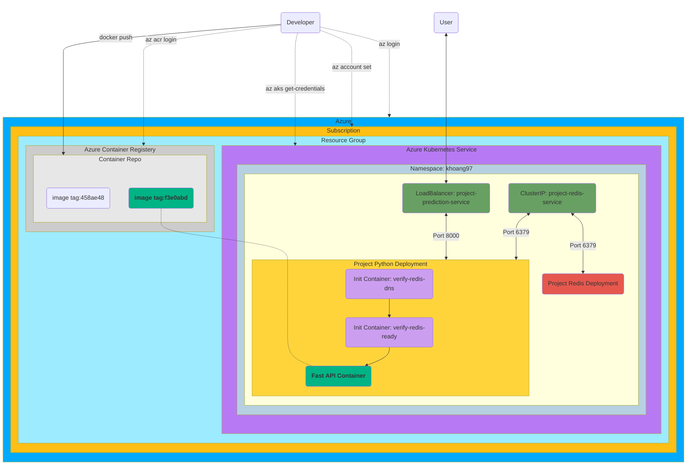

# Deployment of HuggingFace DistilBERT Model onto Azure Kubernetes - Project Report
**Note to Readers:** Only this report README is shared to respect academic integrity. However, I can share the below directory tree and explain the important files at a high level.

Under "base" in ".k8s" are the deployment and service .yaml files for Kubernetes. The project deployment sets up resources, probes, and a horizontal pod autoscaler for the deployment pods which house the model prediction API, while the redis deployment sets up resources for the pod housing a Redis cache to store predictions. The service .yamls expose the deployment pods via an IP address. Here, the kustomization.yaml is used to apply resource configurations without having to go into each deployment/service .yaml file individually.

In "overlays" we have "dev" and "prod" overlays, the former with a kustomize.yaml to apply the namespace in the namespace.yaml and specify deployment pod resources in "base" for local testing in Minikube. The "prod" overlay also has a kustomization.yaml to apply resource requests specified in the patch-deployment-project.yaml. The virtual-service.yaml routes the prediction service to an istio gateway to allow the API to be accessible through a specific domain name.

"main.py" in the "src" directory contains code for the FastAPI application that stores the DistilBERT model for users to run batch and individual predictions. "test_mlapi.py" in the "tests" directory contains unit tests under the pytest framework. We use poetry, namely in the "poetry.lock" and "pyproject.toml" files to handle package dependencies.

Finally, we have a Dockerfile to build a Docker image to enable portability of the model API. This image is pushed to the Azure Container Registry.

```text
.
└── mlapi
  ├── .k8s
  │  ├── base
  │  │   └── deployment-project.yaml
  │  │   └── deployment-redis.yaml
  │  │   └── kustomization.yaml
  │  │   └── service-project.yaml
  │  │   └── service-redis.yaml
  │  ├── overlays
  │  │   ├── dev
  │  │   │   └── kustomization.yaml
  │  │   │   └── namespace.yaml
  │  │   ├── prod
  │  │   │   └── kustomization.yaml
  │  │   │   └── patch-deployment-project.yaml
  │  │   │   └── virtual-service.yaml
  ├── .pytest_cache
  ├── distilbert-base-uncased-finetuned-sst2
  ├── src
  │   └── __init__.py
  │   └── main.py
  ├── tests
  │   └── __init__.py
  │   └── test_mlapi.py
  ├── trainer
  ├── Dockerfile
  ├── poetry.lock
  ├── pyproject.toml
  ├── README.md

```

# Documentation

## Getting Started
This documentation assumes that the user has already installed Python Poetry, Docker, and Minikube. Otherwise, visit https://python-poetry.org/docs/ under the section "With the official installer" to install poetry, and then add poetry to your PATH environment variables. Also, visit https://www.docker.com/get-started/ to install Docker. Finally, visit https://minikube.sigs.k8s.io/docs/start/ to install Minikube.

This repository contains our deployment of the DistilBERT Large Language Model used to classify the sentiment of a given text into positive/negative with class scores/probabilities. We deploy the API in this repository to the cloud to the Azure Kubernetes Service (AKS), and Minikube is leveraged to test the API Kubernetes deployment in a local dev setting.

## Deployment Steps
First, we modified the `pyproject.toml` file to download from the CPU-only wheel of Torch to greatly trim down image size since our model is pretrained, and recent Torch versions have NVidia GPU dependencies that will cause the image to take over 6GB of space on Docker.

After pulling this repository, we executed `poetry install` in the terminal inside the `mlapi` directory to install API package dependencies in order to enable local testing and containerization of the API. We also cloned the DistilBERT model repository at [this HuggingFace link](https://huggingface.co/winegarj/distilbert-base-uncased-finetuned-sst2) under the `mlapi` directory with `git lfs` installed, adding the repository to `.gitignore` due to size.

We then built our Docker image containing our model and the CPU-only Torch installation at 2.1GB space, tagged it with the latest Git commit changing application source code, and pushed it to the class Azure Container Registry. We test locally by applying the dev overlay under `./mlapi/k8s/overlays/dev` locally via kustomize after starting minikube. Finally, we deploy to the AKS cluster by changing to the `w255-aks` context and applying the prod overlay (`./mlapi/k8s/overlays/prod`) via kustomize.

Resource requests for the project container are 1,000 milliCPUs and 1GiB memory, with limits at 3,000 milliCPUs and 2GiB memory due to extensive compute for the LLM. Requests for the initContainers are small at 10 milliCPUs and 10MiB memory with limits at 500 milliCPUs and 500MiB memory. Lastly, requests for the Redis container are 200 milliCPUs and 300MiB memory with limits at 500 milliCPUs and 500MiB memory.

**Note:** After long periods of inactivity with the Project predict endpoints, a user may encounter a 500 error with these endpoints due to a connection timeout between API and Redis pods. The connection will recover when requests are sent, so it is recommended to "warm up" the predict endpoints after long idle times with an empty or small input payload.

## Load Testing Results
We executed a load test to assess our deployed application's performance. This test was conducted using a Google Cloud Virtual Machine on Ubuntu 20.04.6 LTS—n1-standard-1, 1 vCPU, 3.75GB memory, 100GB boot disk size—scaling up to 10 virtual users for a 10 minute sustained load at a 95% cache rate.

Per the attached screenshots, we are pleased to report an average performance of 81.8 ops/sec and a P99 latency of less than 2 seconds. We saw no failed responses out of 51,552 hits, a great sign for our application's error-proneness. The peak latency at the beginning of the load test corresponds to pods coming online via the Horizontal Pod Autoscaler to support the increased load.




## How to Test Prediction Endpoints on the Cloud-Hosted Application
One can test batch inputs using the command `curl -X POST 'https://khoang97.mids255.com/project/bulk-predict' -H 'Content-Type: application/json' -d '{"text": [<INPUTS>]}'` where each element in `<INPUTS>` is a string separated by commas. Note the square brackets, which indicates that `<INPUTS>` are in a list. An example of such a curl request is `curl -X POST 'https://khoang97.mids255.com/project/bulk-predict' -H 'Content-Type: application/json' -d '{"text": ["example 1", "example 2"]}'` which should output a prediction of `[[{"label":"POSITIVE","score":0.74},{"label":"NEGATIVE","score":0.26}],[{"label":"POSITIVE","score":0.77},{"label":"NEGATIVE","score":0.23}]]` truncating scores to first 2 decimal points.

### Testing App Functionality
Additional unit tests are included within `./mlapi/tests/test_mlapi.py` and added to the preexisting test to check that our output model satisfies the proper Pydantic schema. One can check these unit tests by executing `poetry run pytest -vv` in the terminal in the `mlapi` directory, where `-vv` enables verbosity settings to reveal which tests pass or fail. These tests evaluate proper functionality of the below endpoints while checking that 404 errors are thrown at some bad endpoints.

## Application Details
This is a FastAPI application that does the following at the given endpoints.
- `/health` endpoint: responds to GET requests by returning a "healthy" message.
- `/docs` endpoint: is browsable while the API is running and displays default OpenAPI documentation.
- `/openapi.json` endpoint: is browsable while the API is running and returns a json object with OpenAPI version 3.1 depicting the OpenAPI schema.
- `/bulk-predict` endpoint: responds to POST requests, given a list of input text strings, by returning a list of classifications of sentiment from the pulled DistilBERT model. The returned list is formatted such that each element is itself a list of two dictionaries corresponding to an input: one for the positive label with its probability score and the second for the negative label with its probability score. Inputs must be in the form of a dictionary with a single key named "text" whose value is a list of strings.

For the `/bulk-predict` endpoint, submitted inputs are stored as hashed keys in a Redis cache, whose values are the input predictions, to enable faster returns when entering an already submitted input.

**Note:** The `main.py` file consists of three pydantic models to complete: `SentimentRequest`, `Sentiment`, and `SentimentResponse`. However for simplicity, I can pass the requirements under the `test_mlapi.py` pytest file without the `Sentiment` model, namely by setting `SentimentRequest` to have the `text` field as a `list[str]` object and `SentimentResponse` to have the `predictions` field as a `list[list[dict]]` object. Since this also achieves proper formatting of outputs in the Objectives in the root `README.md` and renders the app fully working, I comment out declaring the `Sentiment` model.

The following **Sequence Diagram** summarizes application functionality and process flows.



The **Understanding the Cloud Landscape Diagram** summarizes the Kubernetes infrastructure, mapping out the Project API and Redis deployments and services as they exist in Azure Kubernetes.

